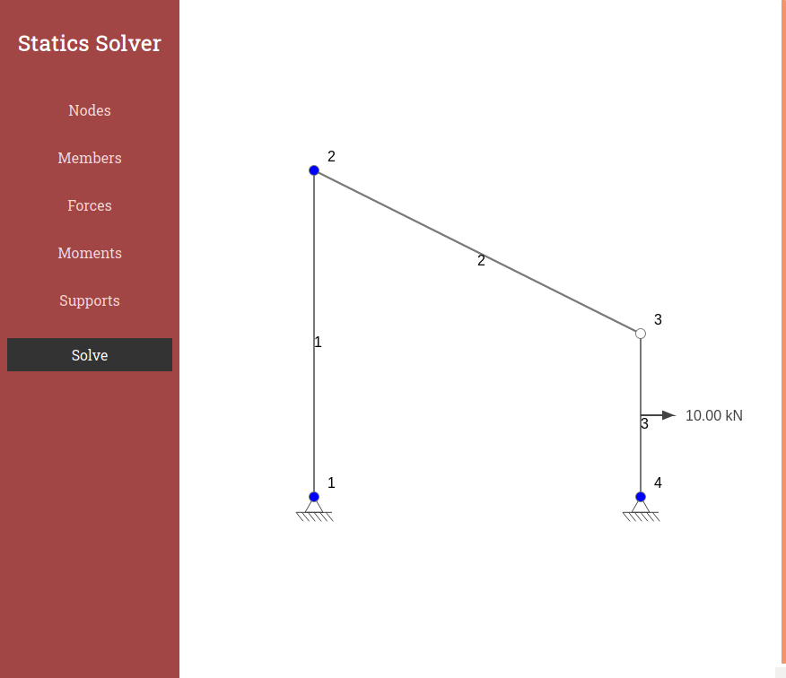
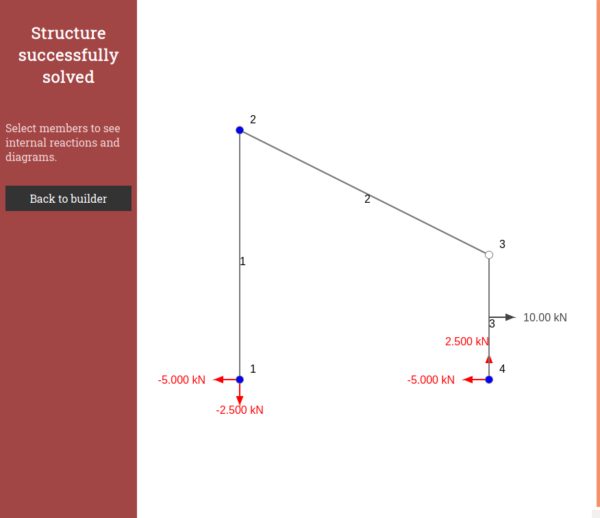
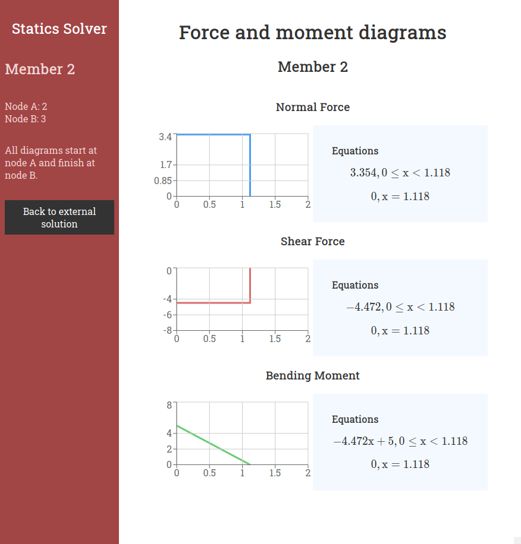

# Truss Solver
React implementation of a numerical solver for truss and frame statics problems. Visualization is implemented through HTML Canvas.
## Main Features
- Create the nodes in any configuration, and arrange them in a 2D space.
    - Nodes may be fixed or hinged joints.
- Assign different boundary conditions to the structure through fixed, hinged, and roller supports.
- Connect nodes through members
- Add forces and moments to nodes and members.
- Solve trusses for external and internal forces.
- Solve frames for external and internal forces, as well as internal normal and shear forces and bending moments.
- Produce equations for the normal and shear forces, as well as the bending moments through integration of the solved data.
## Implementation
- A Gauss-Jacobi solver is used to solve equations.
- Unstable and overdetermined frames are identified, and information is communicated to the user.
- Recharts is used to present data.
- Matrix builders are included in a helper file for the Solver component.
## Running Website
[Truss Problems](https://trussproblems.com/)
## Screenshots
Here are some examples of the types of problems that can be solved by the application:
### Example Frame
A frame can be observed with a force acting on member (3).

### External Solution
Once the "Solve" button is clicked, the reaction forces at the supports are displayed, and internal reactions are calculated.

### Internal Reactions
Clicking on a member leads to the internal reactions.

